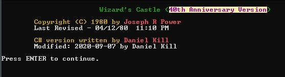
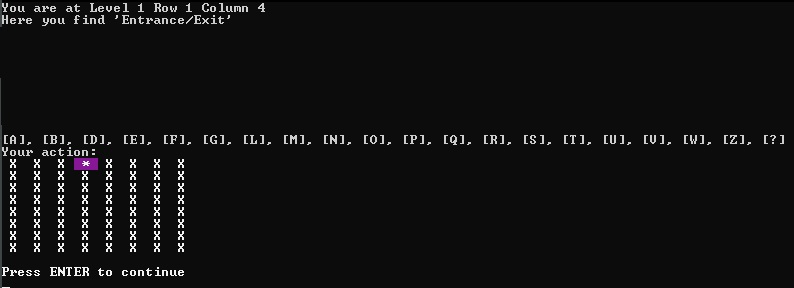

# Wizard's Castle (40th Anniversary C# Edition)
> A remake of the 1980 Exidy Sorcerer game written by JOSEPH R. POWER
> The instructions are included with the game.
> I stayed mostly true to the original, but added some additional functionality.

## Table of contents
* [General info](#general-info)
* [Screenshots](#screenshots)
* [Technologies](#technologies)
* [Setup](#setup)
* [Features](#features)
* [To-do-list](To-do-list)
* [Status](#status)
* [Inspiration](#inspiration)
* [Contact](#contact)

## General info
A full C# remake of the 1980 classic, the Wizard's Castle.\
In addition I have added some new elements to the game.\
I deeply enjoyed this game growing up and wanted to make if for a modern language.\
Exidy Sorcerer game code originally published in the July 1980 edition of Recreational Computing:\
https://archive.org/details/1980-07-recreational-computing

## Screenshots

## Technologies
* C# Console Application
* .NET Framework 4.8
* .NET Core 3.1
* Microsoft Visual Studio Community 2019

## Setup
&nbsp;&nbsp;Clone the repository:\
git clone "https://github.com/yourwishismine/Wizards-Castle-40th-Anniversary-CSharp-Edition.git"\
&nbsp;&nbsp;open Visual Studio 2019 and build it, or you can download the .NET Core 3.1 SDK:\
https://dotnet.microsoft.com/download\
&nbsp;&nbsp;and compile using:\
dotnet publish --runtime win-x64 --configuration Release /p:PublishSingleFile=true /p:PublishTrimmed=true

## Features
Game is fully playable.
* Added support for Random maps
* Added additional game messages
* Added non-interactive elements to empty rooms

## To-do-list
* Fix any bugs
* Add addtional monsters, spells and curses
* Other possibilities...

## Status
Project is: _finished_

## Inspiration
Project based on the 1980 Exidy Sorcerer game written by JOSEPH R. POWER

## Contact
Created by Daniel Kill [@yourwishismine](https://twitter.com/yourwishismine)
